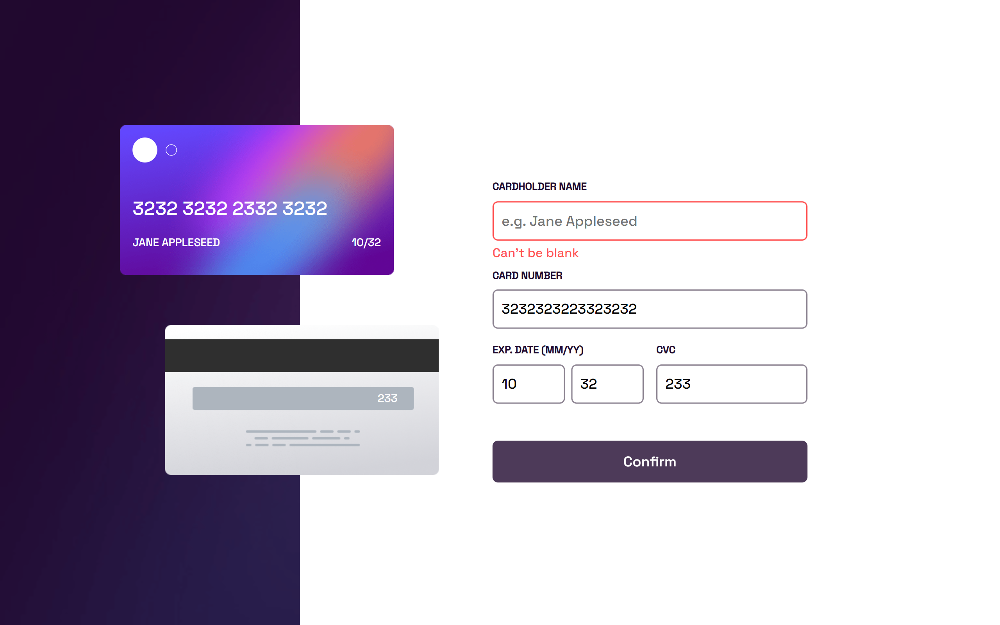

# Frontend Mentor - Interactive card details form solution

This is a solution to the [Interactive card details form challenge on Frontend Mentor](https://www.frontendmentor.io/challenges/interactive-card-details-form-XpS8cKZDWw). Frontend Mentor challenges help you improve your coding skills by building realistic projects. 

## Table of contents

- [Overview](#overview)
  - [The challenge](#the-challenge)
  - [Screenshot](#screenshot)
  - [Links](#links)
- [My process](#my-process)
  - [Built with](#built-with)
- [Author](#author)

## Overview

### The challenge

Users should be able to:

- Fill in the form and see the card details update in real-time
- Receive error messages when the form is submitted if:
  - Any input field is empty
  - The card number, expiry date, or CVC fields are in the wrong format
- View the optimal layout depending on their device's screen size
- See hover, active, and focus states for interactive elements on the page

### Screenshot

### Links

- Solution URL: [https://github.com/codayomide/card-details-form](https://github.com/codayomide/card-details-form)
- Live Site URL: [https://codayomide.github.io/card-details-form/](https://codayomide.github.io/card-details-form/)

## My process

### Built with

- Mobile-first workflow
- [React](https://reactjs.org/) - JS library
- [SCSS](sass-lang.com) - For styles

## Author

- Github - [@codayomide](https://github.com/codayomide) 
- Frontend Mentor - [@codayomide](https://www.frontendmentor.io/profile/codayomide)
- Twitter - [@codayomide](https://www.twitter.com/codayomide)

